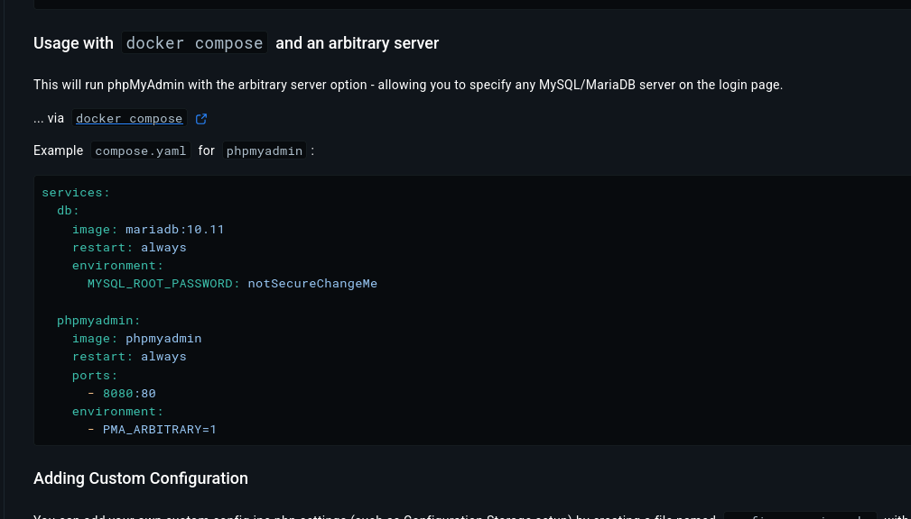
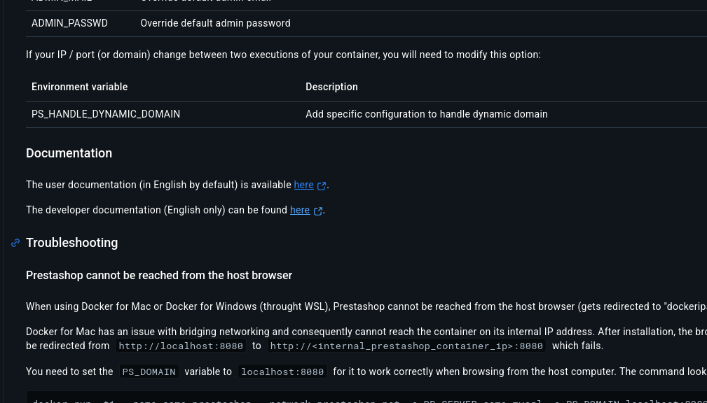
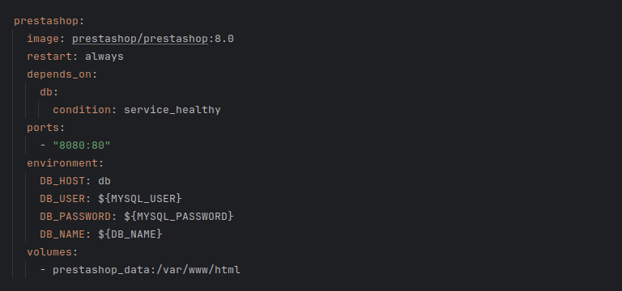

# Tarea 6 SXE

## Pasos a seguir...

### 1º Accedemos a las páginas de docker de cada imagen para ver la estructura entre otras cosas

De esta manera tendremos tanto nuestra base que más adelante cambiamos en vez de ___mariadb___ a ___mysql___ como el
phpAdmin.

A continuación también tendremos que añadir la imagen de ***Prestashop***

***De la siguiente manera:***

Primero en la página de dockerhub de prestashop buscamos el siguiente apartado:

Accedemos a la documentación y dentro de ella en la barra de búsqueda buscamos "docker-compose" y ahi podemos 
ver un ejemplo de prestashop que copiaremos y adaptaremos de la siguiente manera

De esta manera nos quedaria asi el código:
        
        services:
        # Por aqui tenemos nuestra base modifica a mysql
        db:
        image: mysql:latest
        restart: always
        environment:
        #Aqui añadimos la contraseña de nuestra base, usuario, contraseña_root, y nuestra database
        MYSQL_ROOT_PASSWORD: ${MYSQL_ROOT_PASSWORD}
        MYSQL_USER: ${MYSQL_USER}
        MYSQL_PASSWORD: ${MYSQL_PASSWORD}
        MYSQL_DATABASE: ${MYSQL_DATABASE}
        volumes:
        - db_data:/var/lib/mysql # Aqui añadimos los volumenes de la base, Apartado 2
        ports:
          - "3306:3306" # El puerto local de nuestra base
          healthcheck: # Y el healthcheck también de la base , Apartado 3
          test: ["CMD", "mysqladmin", "ping", "-h", "localhost", "-p${MYSQL_ROOT_PASSWORD}"]
          interval: 10s
          timeout: 5s
          retries: 5
          start_period: 30s
        
        # Por aqui tenemos la configuración ajustada de nuestro prestashop
        prestashop:
        image: prestashop/prestashop:8.0 # Con la imagen
        restart: always
        depends_on: # El Depends_on pedido en el apartado 1 con el que le indicamos que primero se instale db y luego ya pueda instalarse prestashop
        db: 
        condition: service_healthy # healthcheck de la base 
        ports:
        - "8080:80" # Puerto con el que nos conectaremos a prestashop ( localhost:8080)
        environment:
        # Requisitos obligatorios
        DB_HOST: db
        DB_USER: ${MYSQL_USER}
        DB_PASSWORD: ${MYSQL_PASSWORD}
        DB_NAME: ${DB_NAME}
        volumes:
          - prestashop_data:/var/www/html # Volumen pedido en el apartado 2
        
        # Por aqui tenemos la configuración de nuestra base
        phpmyadmin:
        image: phpmyadmin # la imagen
        restart: always
        depends_on: # la dependecia con la db para que se instale primero 
        db:
        condition: service_healthy
        ports:
        - "8081:80" # Puerto para acceder (localhost:8081)
        environment:
        #Requisitos obligatorios
        PMA_HOST: db
        PMA_PORT: 3306
        MYSQL_ROOT_PASSWORD: ${MYSQL_ROOT_PASSWORD}
        
        # Estos últimos parametros deberemos añadirlos para que todo el código funcione correctamente 
        volumes:
        db_data:
        prestashop_data:

### A continuación explicaré el funcionamiento del archivo ***.env***

El archivo .env permite administrar de forma segura las contraseñas y los usuarios para no tener que añadirlos en el propio archivo 
docker-compose.yaml

De tal manera todo lo que en el yaml este como ${} podremos ajustarlo en el ***.env***

        # Contraseñas, usuarios, host, bases de datos y puertos
        MYSQL_ROOT_PASSWORD=admin 
        MYSQL_USER=admin
        MYSQL_PASSWORD=admin
        MYSQL_DATABASE=prestashop

        DB_NAME=prestashop
        DB_USER=admin
        DB_PASSWORD=admin
        
        PMA_HOST=db
        PMA_PORT=3306

Con todo esto ya estariamos listo para ejecutar el programa

### Como se ejecuta

Simplemente por la terminal ejecutamos:

        docker compose up
Con esto en principio bastaría para iniciarlo

### Pasas a seguir a continuación de lanzarlo

Accedemos a nuestro navegador y en el apartado de la URL escribimos lo siguiente :

        localhost:8080 # Puerto de prestashop

Primero de todo deberemos completar la instalación de prestashop para poder utilizar luego phpAdmin